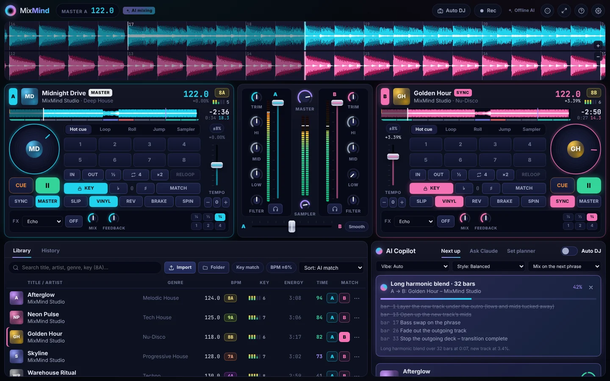
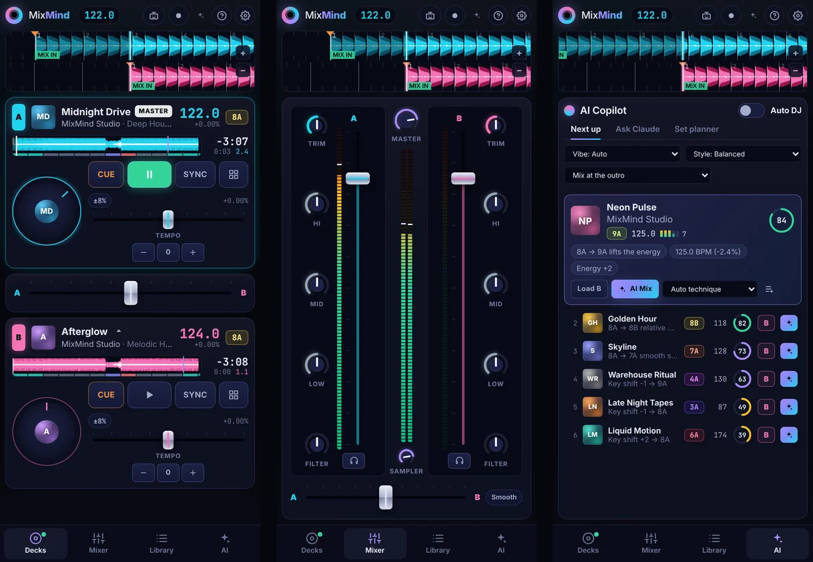

# MixMind — the AI DJ mixer in your browser

A two-deck DJ mixer that runs entirely in the browser, on desktop, tablet and phone, with an AI that
listens to your music, tells you what to play next, and mixes it in for you.



<p align="center"></p>

## What it does

### The AI

- **Hears your music.** Every track is analysed on your device: BPM and beat grid, downbeats, musical
  key (Camelot), energy (1–10), loudness, timbre, and song structure (intro, breakdowns, drops,
  outro, and the best mix-in and mix-out points).
- **Suggests what to play next.** It ranks your whole library against the playing track by harmonic
  compatibility (the Camelot wheel, including fixes by key shift), tempo fit (including half or
  double time), energy direction and sound. Each pick explains itself, for example _"8A → 9A lifts
  the energy"_ or _"125.0 BPM (−2.4%)"_. A vibe setting (keep, build, cool down, switch it up) steers
  the picks.
- **AI Mix.** One tap and it plans a transition, loads and beat-matches the track, starts it on the
  phrase at the exact sample, and performs the EQ, filter, fader and FX moves on the audio clock. It
  has nine techniques: bass-swap blend, long harmonic blend, filter fade, echo out, loop-roll build,
  quick cut, tempo-ramp blend, reverb wash and spinback. If you touch a control during a mix, that
  control is yours and the rest carries on. ✕ cancels the whole transition.
- **Auto DJ.** It plays a whole set hands-free, taking tracks from your queue or its own best pick
  and mixing each one in on the outro.
- **AI DJ chat (optional, free options).** Chat with a DJ assistant that can see your decks and
  library. It can pick tracks, suggest real-world songs to look up (with search links), and plan a
  whole set (for example _"60 minutes, warm-up to peak"_). It works with free services (Google
  Gemini, Groq, OpenRouter, or Ollama on your own computer) as well as Claude.
- **Bollywood suggestions.** _Bollywood songs to mix in_ asks the AI for real Hindi film, Punjabi and
  Indian pop songs that would work after the current track, each with its film and year, a way in,
  and JioSaavn, Spotify and YouTube links. To mix one, import your own copy of the song.

### The decks and mixer

- **Decks:** jog wheels (scratch in vinyl mode, nudge otherwise), sync with beat-phase lock, master
  deck, key lock (time-stretching), key shift and key match, 8 hot cues, auto and manual loops,
  loop rolls, beat jumps, slip, reverse, brake, spinback and quantize.
- **Mixer:** trim, a 3-band isolator EQ with full kills, a low-pass/high-pass filter sweep, channel
  faders with meters, a crossfader with three curves (smooth, linear, cut), master limiter and a
  headphone cue (split cue).
- **Smart crossfader:** one slide can also swap the basses as it passes the middle, or fade the deck
  you're leaving out through a filter. An amber dot on a knob shows where the crossfader is taking it.
- **FX** per deck, synced to the beat: echo, reverb, flanger, phaser, crush, gate and wobble.
- **Sampler:** 8 one-shots (air horn, siren, laser, riser, boom, crash, scratch, rewind) on the
  pads.
- **Waveforms:** scrolling 3-band waveforms on the beat grid, plus an overview with song sections.
- **Recording:** record your mix and download the audio with a tracklist.

### Everywhere

- **Layouts:** separate layouts for desktop, tablet and phone. The app installs as a PWA and keeps
  working offline (the built-in AI runs locally).
- **Multi-touch:** every control follows its own finger, so you can start a deck, ride its volume and
  cut the other deck's bass at the same time. On a phone the Decks screen has each deck's bass,
  filter and volume next to the transport, and pinching on the decks doesn't zoom the page.
- **Controllers and keyboard:** MIDI controllers via MIDI learn, plus keyboard shortcuts.
- **Library:** drag and drop files or whole folders in any format your browser can decode (MP3,
  AAC/M4A, WAV, FLAC, OGG/Opus…). Tags and artwork are read from the files. Everything is stored in
  your browser (IndexedDB).
- **Demo crate:** 8 original demo tracks, from deep house to drum & bass, are generated in your
  browser, so you can mix straight away.

## Quick start

```bash
npm install
npm run dev
```

Open http://localhost:5173 and click **Let's mix**. Two matching demo tracks load onto the decks.
Press ▶ on deck A, then hit **AI Mix** on a suggestion.

Requires Node 22+.

### Turning on the AI chat (free)

The built-in AI (suggestions, AI Mix, Auto DJ) needs no key at all. The AI DJ chat (talking to a DJ
assistant, real-song discovery and set planning) needs a language model, and several are free:

| Service                                         | Cost                                      | Get a key                                                        |
| ----------------------------------------------- | ----------------------------------------- | ---------------------------------------------------------------- |
| **Google Gemini** (default)                     | Free tier on all Flash models, no card    | [Google AI Studio](https://aistudio.google.com/apikey)           |
| **Groq**                                        | Free tier, very fast, ~1,000 requests/day | [GroqCloud console](https://console.groq.com/keys)               |
| **OpenRouter**                                  | Free models, 50 requests/day              | [OpenRouter keys](https://openrouter.ai/keys)                    |
| **Ollama**                                      | Free, runs on your own computer, no key   | [Download Ollama](https://ollama.com/download)                   |
| **Anthropic Claude**                            | Paid                                      | [Anthropic Console](https://console.anthropic.com/settings/keys) |
| Any OpenAI-compatible API (LM Studio, Mistral…) | Depends                                   | –                                                                |

To connect, open the **Ask AI** tab (or click **Offline AI** in the top bar), pick a service, follow
the two steps to get a key, paste it and press **Connect**. The key is checked first, then saved only
in your browser and sent only to that service, so this also works on static hosting with no server.

To give everyone using your deployment the chat without their own key, set one key on the server
instead (`cp .env.example .env`, then for example `GEMINI_API_KEY=...`). It stays on the server and the
browser talks to `/api`. A visitor who connects their own service uses that instead.

Model defaults: `gemini-flash-lite-latest` (answers in about 2 seconds; if a model is overloaded the app
moves on to another free one), `openai/gpt-oss-120b` (Groq), `openrouter/free` (OpenRouter
picks a free model) and `llama3.2` (Ollama). You can change the model in the app; **Connect** loads
the list the service offers. Claude defaults to Claude Opus 5.5, and its requests opt into Anthropic's
server-side refusal fallbacks (`fallbacks: "default"`).

**Privacy:** audio never leaves your device. The AI service only receives track metadata (title,
artist, genre, BPM, key, energy, length, mood, intro and outro length) and what the decks are doing.
On free tiers some providers (for example Google) may use requests to improve their products.

## Deploying

```bash
npm run build   # web app → dist/, API server → dist-server/
npm start       # serves both on http://localhost:8787
```

| Variable                                                                       | Default          | Purpose                                                                           |
| ------------------------------------------------------------------------------ | ---------------- | --------------------------------------------------------------------------------- |
| `GEMINI_API_KEY` / `GROQ_API_KEY` / `OPENROUTER_API_KEY` / `ANTHROPIC_API_KEY` | –                | Turns on the AI chat through the server (first key found is used)                 |
| `AI_PROVIDER`                                                                  | auto             | Force a provider: `gemini`, `groq`, `openrouter`, `ollama`, `anthropic`, `custom` |
| `AI_MODEL`                                                                     | provider default | Model to use                                                                      |
| `AI_BASE_URL` / `AI_API_KEY`                                                   | –                | Address and key for `ollama` or `custom` (OpenAI-compatible)                      |
| `MIXMIND_RATE_LIMIT`                                                           | `40`             | AI requests per IP per 5 minutes                                                  |
| `PORT` / `HOST`                                                                | `8787` / 0.0.0.0 | Where the server listens                                                          |
| `BASE_PATH`                                                                    | `/`              | Build-time base path when hosting under a sub-path                                |

**Docker:**

```bash
docker build -t mixmind .
docker run -p 8787:8787 -e GEMINI_API_KEY=your-free-key mixmind
```

**GitHub Pages:** the included workflow publishes the site to `https://<user>.github.io/<repo>/` after
CI passes on the default branch. One-time setup:

1. Settings → Pages → Build and deployment → Source: **GitHub Actions**. (On GitHub Free, Pages needs a
   public repository.)
2. Actions → **Deploy to GitHub Pages** → **Run workflow** (later pushes deploy by themselves).

There's no server on Pages, so each visitor connects the AI chat with their own free key. To give
everyone the chat without one, add a repository secret named `GEMINI_API_KEY` (Settings → Secrets and
variables → Actions) and run the deploy again. That key ends up in the page code where anyone can read
it, so restrict it first: in the [Google Cloud console](https://console.cloud.google.com/apis/credentials),
open the key and set **Application restrictions → Websites** to `https://<user>.github.io/*`.

Any other static host works too: build with `BASE_PATH=/sub/path/ VITE_NO_SERVER=1 npx vite build` and
upload `dist/`.

Phones need HTTPS to install the app and use MIDI (localhost is fine for development).

## How it works

```
src/
  audio/       Web Audio engine. One AudioWorklet renders both decks sample by sample
               (WSOLA time-stretch for key lock, scratching, loops, sync PLL, sample-accurate
               armed starts). Mixer strips (LR4 isolator EQ, filter), FX, sampler, recorder.
  analysis/    Web Worker: FFT and onsets → tempo and beat grid, downbeats, key, loudness,
               structure, timbre.
  library/     Import, tags and artwork, IndexedDB, decoding, the demo-track synthesizer.
  ai/          Recommender, transition planner, auto-mixer, Auto DJ, and the chat's language-model
               clients (one for OpenAI-compatible APIs, one for Claude) with shared prompts.
  controller/  Deck and mixer actions, the engine ↔ UI bridge, keyboard, MIDI, recording.
  components/  React UI: decks, mixer, waveforms, library, AI panel.
  state/       Zustand stores.
server/        Hono API: /api/health, /api/ai/picks, /api/ai/chat (streaming), /api/ai/setplan.
```

- **Recommendations** blend four scores, weighted by the chosen style. "Balanced" is 32% harmonic,
  30% tempo, 20% energy and 18% timbre. Other styles favour key, energy flow or sound.
- **Transition plans** are bar-aligned automation lanes (faders, EQs, filters, FX sends) plus
  actions (loops, FX, spinbacks), laid out on the outgoing track's phrase grid. The auto-mixer
  schedules them as Web Audio automation and starts the incoming deck inside the audio thread, so
  mixes stay tight even when the tab is in the background.

## Keyboard shortcuts

| Keys              | Action                           |
| ----------------- | -------------------------------- |
| `Q` / `U`         | Cue deck A / B (hold to preview) |
| `W` / `I`         | Play / pause deck A / B          |
| `E` / `O`         | Sync deck A / B                  |
| `1–4` / `7–0`     | Hot cues 1–4 (Shift deletes)     |
| `A` `S` / `J` `K` | Nudge slower / faster (hold)     |
| `D` / `L`         | Auto loop on / off               |
| `F` / `;`         | Key lock                         |
| `←` `→` `↓`       | Crossfader left / right / centre |
| `M`               | AI Mix the top suggestion        |
| `Shift` + `M`     | Cancel the AI transition         |
| `N`               | Auto DJ on / off                 |
| `Shift` + `R`     | Start / stop recording           |
| `/`               | Search the library               |
| `?`               | Help                             |

## Development

| Command             | What it does                                                            |
| ------------------- | ----------------------------------------------------------------------- |
| `npm run dev`       | Dev server with the API mounted (reads `.env`)                          |
| `npm test`          | Unit tests: DSP, analysis accuracy, harmonic rules, planner, AI clients |
| `npm run test:e2e`  | Playwright on desktop and phone, against the production build           |
| `npm run lint`      | ESLint                                                                  |
| `npm run typecheck` | TypeScript (strict)                                                     |
| `npm run format`    | Prettier                                                                |

CI runs all of these on every push.

## Browser support

Recent Chrome, Edge, Safari (16.4+) and Firefox. On iPhone, MixMind asks iOS for a playback audio
session so the ring/silent switch doesn't mute it.

## License

[MIT](LICENSE)
